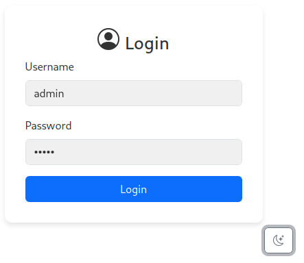
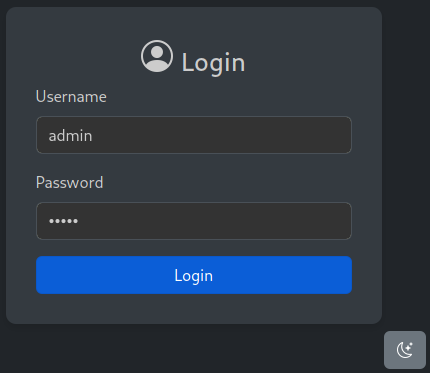
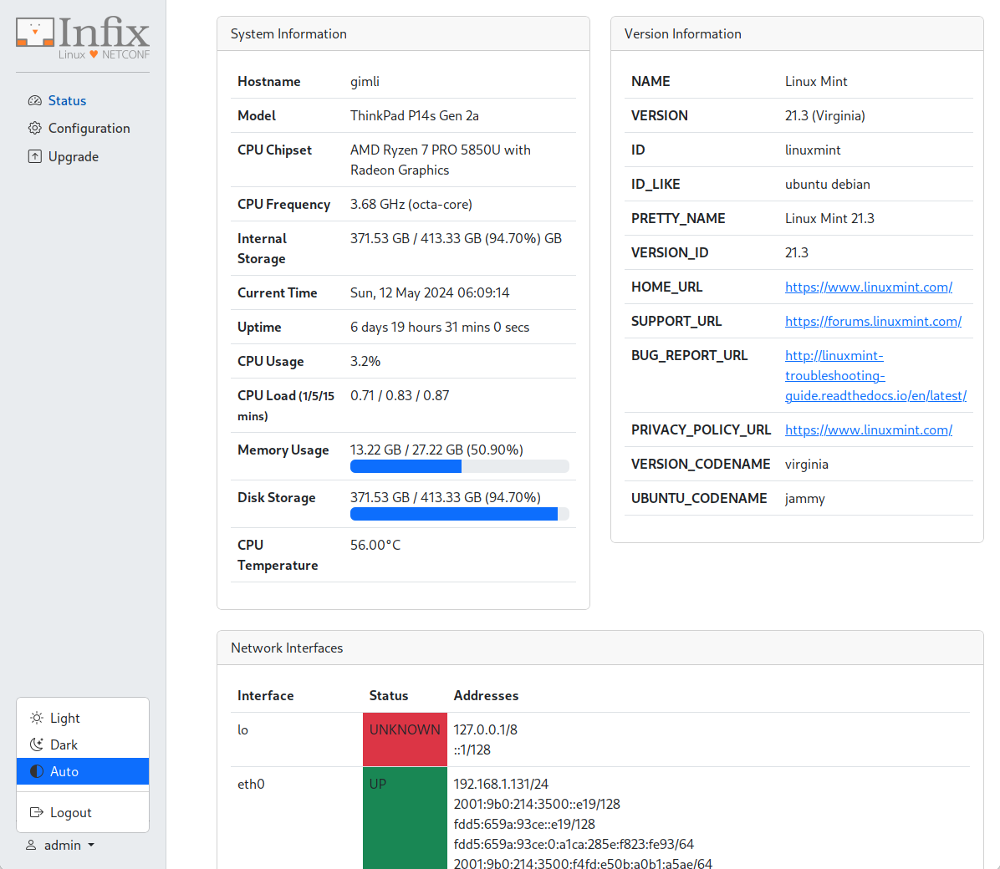

WebUI Portal Prototype for Infix
================================

This project uses Flask and Bootstrap to create a very basic WebUI
Portal for Infix, with proper login and session handling.  Current
authentication is user/pass: admin/admin, proper PAM support is in
progress.

Screenshots
-----------

