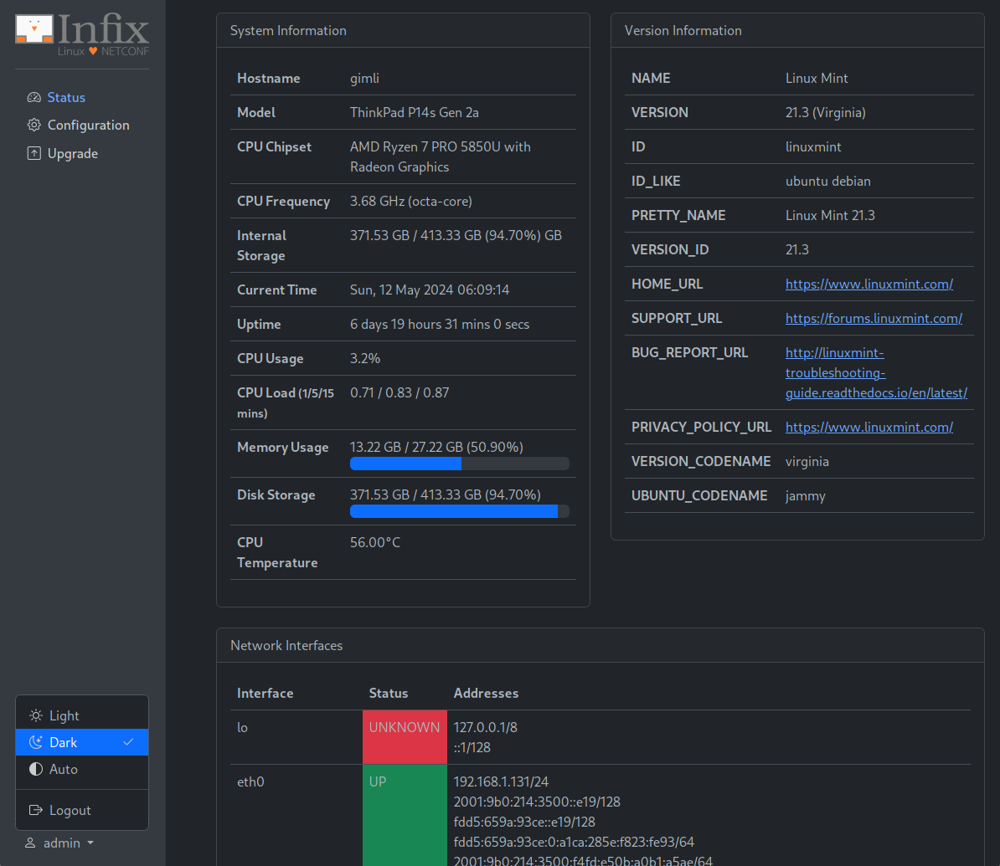

WebUI Portal Prototype for Infix
================================

This project uses Go+HTMX and Bootstrap to create a very basic WebUI
Portal for Infix, with proper login and session handling.

When started in developer mode authentication is user/pass: admin/admin,
by default however, proper PAM support is used.

Currently you need at least Go 1.21.  Remember to fetch all deps first:

```bash
$ go mod tidy
```

Then you can run the program in developer/debug mode:

```bash
$ make run
```

It is also possible to `make install` the program, by default to
`/usr/bin` with all its static files in `/usr/share/webui`.


Screenshots
-----------

> [!NOTE]
> Out of date, but shows general design at least.



